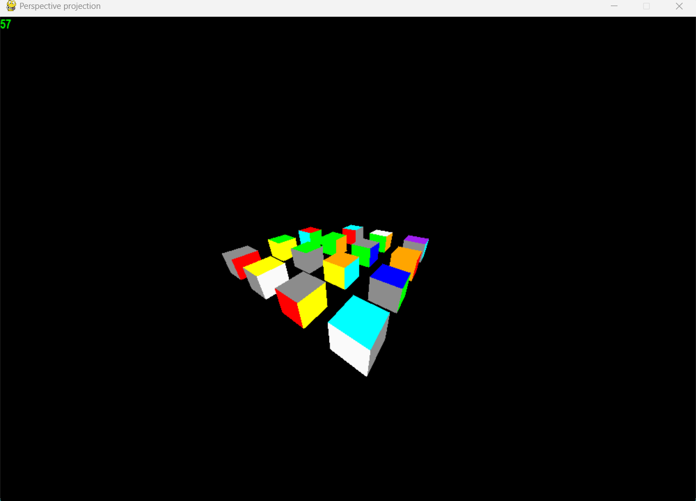
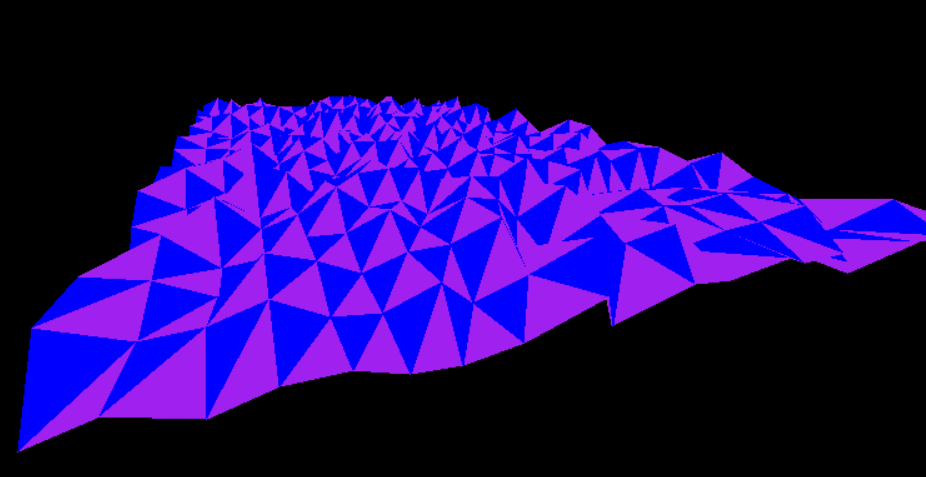
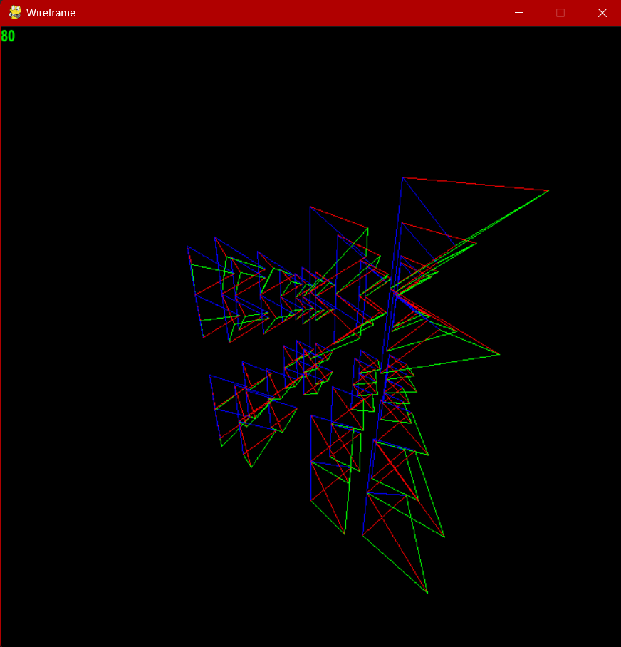
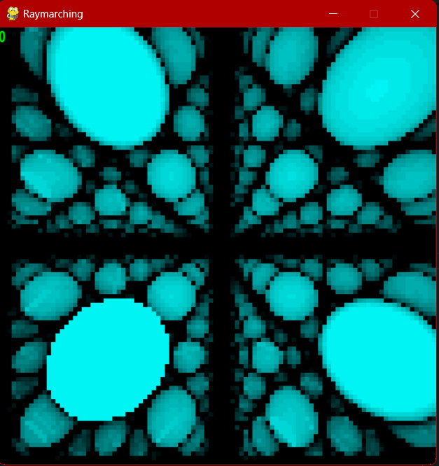

# Perspective Projection

A perspective projection rasterizer for polygons with mouse and keyboard control

# Wireframe

An efficient rasterizer for wireframe objects with good performance even for rotating shapes

# Raymarching

A low resolution implementation of raymarching using signed distance functions, using modular arithmetic allows for infinite objects

